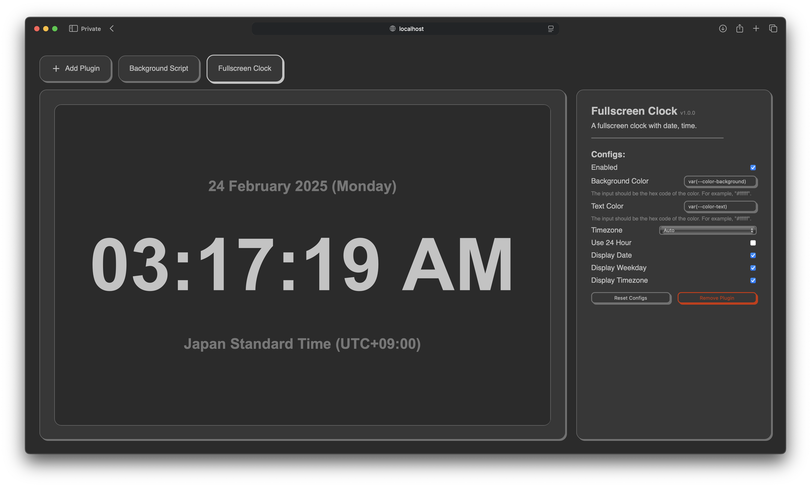

<div align="center">

# RPi WidgetBox

[](https://github.com/nohackjustnoobb/RPi-WidgetBox/actions/workflows/main.yml)
[](https://github.com/nohackjustnoobb/RPi-WidgetBox/blob/master/LICENSE)
[](https://hub.docker.com/repository/docker/nohackjustnoobb/rpi-widgetbox)

</div>



RPi WidgetBox is a simple desktop widget application designed primarily for Raspberry Pi and other small-screen devices. However, it can run on any device that supports a modern web browser.

Features

- Lightweight & flexible—runs on low-power devices
- Plugin-based system—comes with no built-in widgets, allowing full customization
- Cross-platform—works on Raspberry Pi, PCs, and more

To use the application, you'll need to add plugins. Several common plugins are available, including a fullscreen clock, weather widget. Check out the [RPi-WidgetBox-Plugins](https://github.com/nohackjustnoobb/RPi-WidgetBox-Plugins) repository for more details.

## Quick Start

### Option 1: Using Docker Compose

1. Create the docker-compose.yml File

Create a docker-compose.yml file with the following sample configuration:

`docker-compose.yml`

```yml
version: "3"

services:
  app:
    image: nohackjustnoobb/rpi-widgetbox
    container_name: rpi-widgetbox
    ports:
      - "3012:3012"
    volumes:
      - ./plugins:/app/plugins
    restart: unless-stopped
```

2. Run the Docker Image

Start the application using Docker Compose:

```bash
sudo docker compose up -d
```

### Option 2: Manual Setup

1. Clone the Repository

First, clone the repository and navigate into the project directory:

```bash
git clone https://github.com/nohackjustnoobb/RPi-WidgetBox && cd RPi-WidgetBox
```

2. Build the Static Files

Ensure you have `node` and `yarn` installed before running the build script:

```bash
chmod +x build_static.sh && ./build_static.sh
```

3. Build the Rust Application

Compile the Rust project in release mode:

```bash
cargo build --release
```

4. Run the Application

Start the application by running the following:

```bash
./target/release/rpi-widgetbox
```

## Useage

1. Run the application. The server will start and listen on port `3012`.

2. Open your browser and go to `http://localhost:3012`. This page displays the widgets.

- Double-click the screen to switch to the next one.

3. To edit the widgets, go to `http://localhost:3012/edit`.

## Development Setup

1. Clone the Repository

First, clone the repository and navigate into the project directory:

```bash
git clone https://github.com/nohackjustnoobb/RPi-WidgetBox && cd RPi-WidgetBox
```

2. Build the Static Files

Ensure you have `node` and `yarn` installed before running the build script:

```bash
chmod +x build_static.sh && ./build_static.sh
```

3. Run the Application

Finally, start the application using Cargo:

```bash
cargo run
```

## Roadmap to v1.0.0

- [x] Display modules
- [x] Build script
- [ ] Documentation
- [x] Dockerize
- [ ] Auto-Update
- [ ] Customizable display options
- [ ] New Config Type: Web Component
- [ ] New Config Type: Upload
